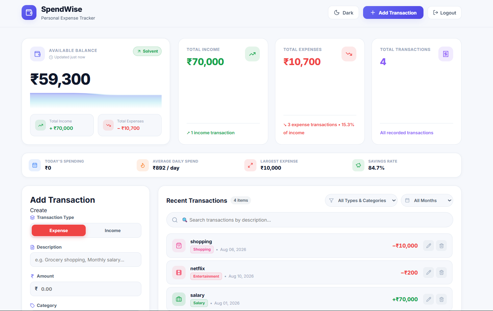
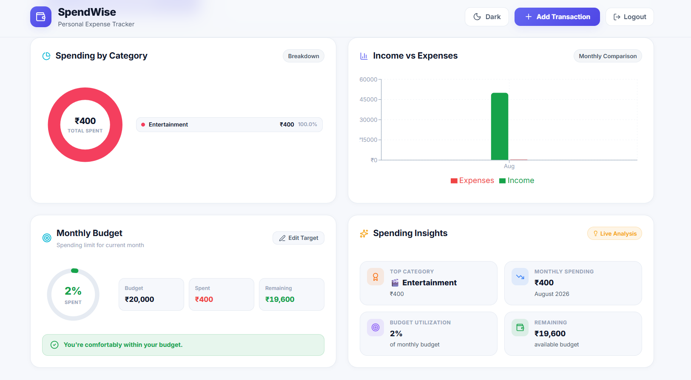

# 💰 SpendWise

### Modern Personal Expense Tracker

SpendWise is a modern full-stack personal finance application built with React and Supabase. It helps users track income and expenses, manage monthly budgets, analyze spending patterns, and securely store financial data.

> 🎯 Built to provide a clean, simple, and intuitive way to understand and manage personal finances.

---

## 🌐 Live Demo

🔗 **Live Demo:** `YOUR_NETLIFY_URL`

🔗 **GitHub:** `YOUR_GITHUB_REPO_URL`

---

## 📸 Screenshots

### Dashboard



### Analytics



### Authentication


> Replace the screenshot paths with your actual screenshots.

---

# ✨ Features

## 💰 Financial Dashboard

Get an instant overview of your finances:

- Available balance
- Total income
- Total expenses
- Total transactions
- Quick financial statistics
- Savings rate

---

## 🧾 Transaction Management

Manage your financial transactions with complete CRUD functionality.

- ➕ Add transactions
- ✏️ Edit transactions
- 🗑️ Delete transactions
- 🔍 Search transactions
- 🔽 Filter by transaction type
- 🏷️ Filter by category
- 📅 Filter by month
- 💵 Indian currency formatting

Supported expense categories:

- 🍔 Food
- 🚕 Travel
- 🛍️ Shopping
- 💡 Bills
- 📚 Education
- 🎬 Entertainment
- 💼 Other

Supported income categories:

- 💼 Salary
- 💻 Freelance
- 📈 Investment
- 🎁 Gift
- ↩️ Refund
- 💼 Other

---

# 📊 Financial Analytics

SpendWise converts transaction data into useful visual insights.

### Spending by Category

A responsive donut chart displays how expenses are distributed across categories.

### Income vs Expenses

Compare monthly income and expenses using an interactive chart.

### Spending Insights

Automatically generated statistics include:

- Highest spending category
- Monthly spending
- Budget utilization
- Remaining budget
- Savings rate
- Largest expense

---

# 🎯 Monthly Budget

Set a monthly spending limit and track your progress.

The budget dashboard displays:

- Monthly budget
- Total spent
- Remaining budget
- Budget utilization percentage
- Visual progress indicator
- Budget warnings

Budget status changes automatically depending on spending:

```text
0–70%      → Healthy
70–90%     → Warning
90–100%    → Critical
100%+      → Over Budget
